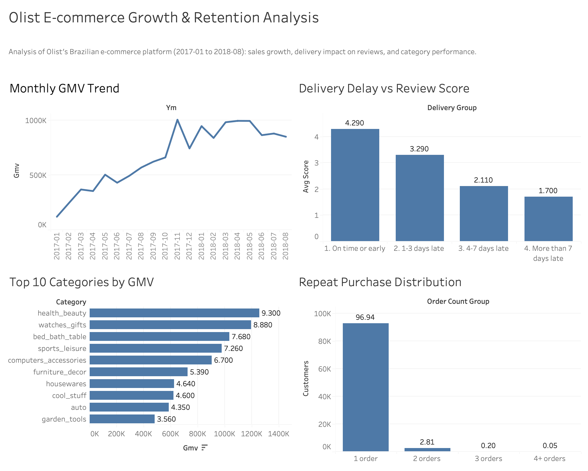

# Olist E-Commerce SQL Analysis

A SQL-only portfolio project analyzing the [Brazilian E-Commerce Public Dataset by Olist](https://www.kaggle.com/datasets/olistbr/brazilian-ecommerce) (Kaggle), covering ~100K orders from a Brazilian online marketplace between 2016 and 2018.

**Goal:** answer five business questions end-to-end — schema design, data cleaning, analysis, and visualization — using MySQL and Tableau.

## Tech Stack
- **MySQL 9** (MySQL Workbench) — schema design, data loading, analysis queries
- **Tableau Desktop** — dashboard
- SQL techniques used: CTEs, multi-table JOINs, window functions (`LAG`, `RANK`, `DENSE_RANK`, `SUM() OVER`), conditional aggregation (`CASE WHEN`), date functions (`DATEDIFF`, `TIMESTAMPDIFF`, `DATE_FORMAT`)

## Dashboard

## Entity-Relationship Diagram

8 normalized tables: `customers`, `sellers`, `products`, `category_translation`, `orders`, `order_items`, `order_payments`, `order_reviews`. `orders` is the central fact table, linked to `order_items` (composite PK), `order_payments` (composite PK), and `order_reviews`. `order_items` links out to `products` and `sellers`.

**Note:** `customers.customer_id` is regenerated for every order; `customers.customer_unique_id` is the actual person-level identifier and is what all customer-level analysis (repeat purchase rate, cohort retention) is built on.

## Data Scope & Definitions

- **GMV** = sum of item price (`order_items.price`) across orders; freight/shipping value is excluded unless stated otherwise.
- Canceled orders (`order_status = 'canceled'`) are excluded from all revenue and customer metrics.
- The dataset's first and last few months (2016-09 to 2016-12, and 2018-09) have incomplete data and are excluded from trend analysis; the analysis window is **2017-01 to 2018-08**.

## Files

| File | Description |
|---|---|
| `01_schema.sql` | Database and table creation (8 normalized tables, PKs/FKs, indexes) |
| `02_load.sql` | `LOAD DATA LOCAL INFILE` import scripts + post-load validation checks |
| `analysis1_monthly_sales_trend.sql` | Monthly GMV/order trend with month-over-month growth |
| `analysis2_repeat_purchase_rate.sql` | Overall repeat purchase rate and order-count distribution |
| `analysis3_cohort_retention.sql` | Cohort retention by first-purchase month |
| `analysis4_delivery_vs_review.sql` | Delivery delay vs. review score |
| `analysis5_category_performance.sql` | Category revenue ranking and 2017 vs 2018 share of revenue |
| `models/olist_er.mwb` | MySQL Workbench model file (editable ER diagram source) |
| `images/` | Exported ER diagram and Tableau dashboard screenshots |

Each analysis file starts with a comment block stating the business question, data scope/assumptions, the SQL techniques used, and a one-line finding.

## Key Findings

**1. Growth is driven almost entirely by order volume, not order value.**
Monthly orders grew from 787 to 6,421 (~8x) between Jan 2017 and Aug 2018, while GMV grew ~7x (R$120K → R$849K). Average order value stayed flat at R$125–155. GMV first crossed R$1M in Nov 2017 (+52.1% MoM), likely tied to a seasonal promotion, before falling back in December. Growth largely plateaued through 2018.

**2. Repeat purchase rate is very low — 3.06%.**
Of 95,560 customers, only 2,924 placed more than one order; 97% bought exactly once. Combined with the order-volume growth above, this indicates the platform's growth is driven almost entirely by new customer acquisition rather than retention.

**3. Cohort retention confirms the pattern — no cohort exceeds ~0.7% monthly retention.**
Across every first-purchase cohort from Jan 2017 to Aug 2018, the share of customers returning in any subsequent month stays under 1%, with no consistent decay curve (retention is closer to random noise than a normal decay pattern). The Nov 2017 promotional cohort did not show meaningfully better long-term retention than other months.

**4. Delivery delay is strongly associated with lower review scores.**
Among delivered orders (95,823 with reviews): on-time/early orders (93.3% of the total) average 4.29 with a 9.2% low-score (≤2) rate. This drops to 3.29 (32.2% low-score) for 1–3 days late, 2.11 (67.6%) for 4–7 days late, and 1.70 (79.2%) for more than 7 days late. Customer tolerance for delay appears to sit around 3 days. This correlation does not establish causation, but it lines up with the low retention seen above as a plausible contributing factor.

**5. Revenue is spread across categories; growth is concentrated in a few.**
No single category dominates — the top 10 of ~70+ categories account for ~62% of GMV, with the largest (`health_beauty`) at just 9.3%. Order count and GMV rank don't always align (`watches_gifts` ranks #2 in GMV with a much higher average order value than higher-volume categories like `bed_bath_table`). Comparing Jan–Aug 2017 vs. Jan–Aug 2018 (platform GMV grew ~138% overall), `health_beauty` (+211%), `watches_gifts` (+243%), and `baby` (+264%) grew well above average and moved up in rank, while `bed_bath_table` (+107%) and `cool_stuff` (+8.9%) fell behind.

## How to Reproduce

1. Download the dataset from Kaggle and place the CSVs in one folder.
2. Run `01_schema.sql` in MySQL Workbench to create the database and tables.
3. Enable local file loading: `SET GLOBAL local_infile = 1;` and add `OPT_LOCAL_INFILE=1` to your connection's Advanced settings.
4. Edit the file paths in `02_load.sql` to point to your CSV folder, then run it. The script ends with row-count and orphan-record validation checks.
5. Run the `analysis*.sql` files in order.
6. Export each query result to CSV and connect them in Tableau to reproduce the dashboard (or connect Tableau directly to the MySQL database).

## Author

Bingling Lu
